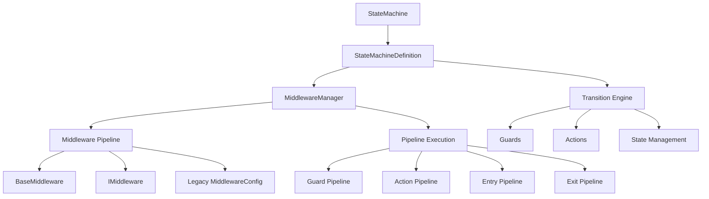
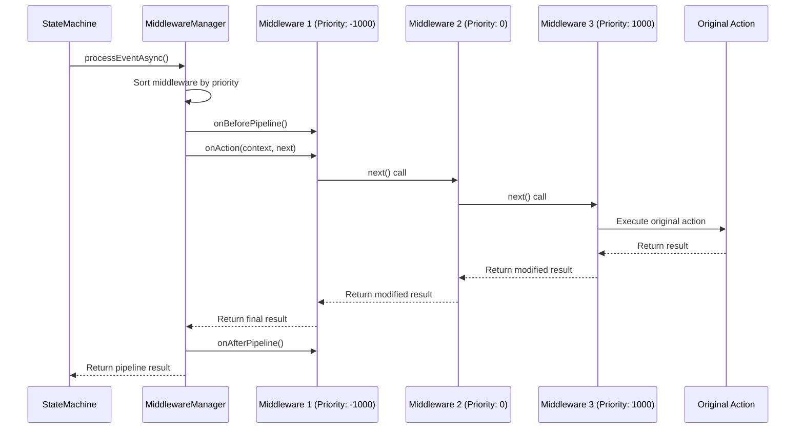
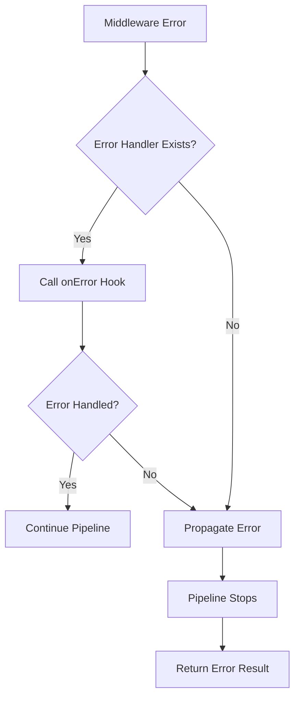

# Architecture Overview

This document provides a comprehensive overview of the @jewel998/state-machine library architecture,
focusing on the recent enhancements to the middleware pipeline system.

## Core Architecture

The library follows a **stateless pattern** with **middleware pipeline architecture** that provides
high performance, type safety, and extensibility.

### Key Components



## Middleware Pipeline System

The middleware system provides a robust, type-safe, and performant pipeline architecture designed
specifically for state machines.

### Pipeline Architecture



### Key Features

#### 1. Complete Pipeline Implementation

All pipeline methods are now fully implemented:

- **`executeGuardPipeline`** - Executes guard middleware in priority order
- **`executeActionPipeline`** - Executes action middleware with context passing
- **`executeEntryPipeline`** - Executes state entry middleware
- **`executeExitPipeline`** - Executes state exit middleware

#### 2. BaseMiddleware Class

A new abstract base class that provides:

```typescript showLineNumbers
abstract class BaseMiddleware<TContext, TState> implements IMiddleware<TContext, TState> {
  // Core properties
  readonly name: string;
  readonly priority: number;
  readonly enabled: boolean;

  // Pipeline hooks (new)
  onBeforePipeline?(context): Promise<void>;
  onAfterPipeline?(context, result): Promise<void>;

  // Legacy chain hooks (backward compatibility)
  onBeforeChain?(context): Promise<void>;
  onAfterChain?(context, result): Promise<void>;

  // Middleware hooks
  onGuard?(context, next, originalGuard): Promise<boolean>;
  onAction?(context, next, originalAction): Promise<MiddlewareResult>;
  onStateEntry?(context, next, state, originalAction): Promise<MiddlewareResult>;
  onStateExit?(context, next, state, originalAction): Promise<MiddlewareResult>;

  // Error handling
  onError?(error, context): Promise<void>;

  // Utility methods
  protected createResult(context, shouldContinue, metadata?): MiddlewareResult;
  protected mergeMetadata(existing, additional): Record<string, unknown>;
  protected shouldSkip(context): boolean;
}
```

#### 3. Enhanced Context Information

Each middleware receives rich context information:

```typescript showLineNumbers
interface StateMachineMiddlewareContext<TContext> {
  readonly originalContext: TContext; // Original context at pipeline start
  readonly currentContext: TContext; // Current context (may be modified)
  readonly metadata: Record<string, unknown>; // Pipeline metadata
  readonly pipelineId: string; // Unique pipeline execution ID
  readonly executionOrder: number; // Order in pipeline (0-based)
  readonly previousResults: MiddlewareResult[]; // Results from previous middleware
}
```

#### 4. Type Safety Improvements

- Removed all `any` types from middleware system
- Enhanced generic constraints for better type inference
- Proper TypeScript support for both new and legacy middleware

#### 5. Flexible Configuration

The system supports multiple middleware configuration approaches:

- Class-based middleware extending `BaseMiddleware` (recommended)
- Configuration-based middleware using `MiddlewareConfig`
- Chain hooks (`onBeforeChain`, `onAfterChain`) alongside pipeline hooks
- Mix and match different middleware styles in the same application

## Performance Characteristics

### Memory Efficiency

The stateless pattern provides significant memory benefits:

- **98% reduction** in per-object memory usage (100 bytes vs 6KB)
- **O(n+m) memory complexity** where n = objects, m = middleware
- **Zero per-object overhead** for middleware

### Execution Performance

Pipeline execution is optimized for performance:

- **Priority-based sorting** happens once during definition creation
- **Lazy middleware instantiation** only when needed
- **Context passing optimization** minimizes object creation
- **Error handling** with minimal performance impact

### Scalability

The architecture scales linearly:

- **Millions of objects** can share a single definition
- **Middleware pipeline** executes consistently regardless of object count
- **Concurrent execution** supported across multiple workers

## Error Handling Architecture

### Error Types

The system defines specific error types for different scenarios:

```typescript showLineNumbers
// Core state machine errors
class StateMachineError extends Error
class InvalidStateError extends StateMachineError
class InvalidTransitionError extends StateMachineError
class GuardConditionError extends StateMachineError
class ActionExecutionError extends StateMachineError

// Middleware-specific errors
class MiddlewareError extends StateMachineError
class PipelineExecutionError extends MiddlewareError
```

### Error Propagation



### Recovery Mechanisms

Middleware can implement error recovery:

```typescript showLineNumbers
class RecoveryMiddleware extends BaseMiddleware<Context, State> {
  async onAction(context, next, originalAction) {
    try {
      return await next();
    } catch (error) {
      // Attempt recovery
      if (this.canRecover(error)) {
        return this.createResult(
          this.recoverContext(context.currentContext),
          true, // Continue pipeline
          { recovered: true, originalError: error.message }
        );
      }
      throw error; // Re-throw if can't recover
    }
  }

  async onError(error, context) {
    // Global error handler for this middleware
    this.logError(error, context);
  }
}
```

## Integration Patterns

### Frontend Integration

For frontend applications (React, Vue, Angular):

```typescript showLineNumbers
// Immutability-focused middleware stack
const frontendDefinition = StateMachine.definitionBuilder<UIState, UIStates, UIEvents>()
  .initialState('LOADING')
  // ... states and transitions
  .addMiddleware(createImmerMiddleware({ autoFreeze: true }))
  .addMiddleware(new StateValidationMiddleware())
  .addMiddleware(new UIUpdateMiddleware())
  .buildDefinition();

// Use async methods for full middleware support
const newState = await frontendDefinition.processEventAsync(
  currentState,
  'USER_ACTION',
  currentContext
);

// Context is immutable and safe for React/Vue
setAppState(newState.context);
```

### Backend Integration

For backend applications (Node.js, Deno):

```typescript showLineNumbers
// Performance and monitoring focused middleware stack
const backendDefinition = StateMachine.definitionBuilder<
  ServerContext,
  ServerStates,
  ServerEvents
>()
  .initialState('IDLE')
  // ... states and transitions
  .addMiddleware(new AuthenticationMiddleware(authService))
  .addMiddleware(new RateLimitMiddleware(100, 60000))
  .addMiddleware(new MetricsMiddleware(metricsCollector))
  .addMiddleware(new LoggingMiddleware(logger))
  .buildDefinition();

// Process business logic with middleware pipeline
const result = await backendDefinition.processEventAsync(
  currentState,
  'PROCESS_REQUEST',
  requestContext
);
```

### Microservices Integration

For distributed systems:

```typescript showLineNumbers
class DistributedMiddleware extends BaseMiddleware<Context, State> {
  constructor(private eventBus: EventBus) {
    super('distributed', { priority: 1000 });
  }

  async onAfterPipeline(context, result) {
    // Publish state changes to event bus
    await this.eventBus.publish('state-changed', {
      pipelineId: context.pipelineId,
      previousState: context.originalContext.state,
      newState: result.context.state,
      metadata: result.metadata,
    });
  }
}
```

## Testing Architecture

### Middleware Testing

The architecture supports comprehensive testing:

```typescript showLineNumbers
describe('CustomMiddleware', () => {
  let middleware: CustomMiddleware;
  let mockNext: jest.Mock;
  let context: StateMachineMiddlewareContext<TestContext>;

  beforeEach(() => {
    middleware = new CustomMiddleware();
    mockNext = jest.fn();
    context = {
      originalContext: { value: 'original' },
      currentContext: { value: 'current' },
      metadata: {},
      pipelineId: 'test-pipeline',
      executionOrder: 0,
      previousResults: [],
    };
  });

  it('should process action correctly', async () => {
    mockNext.mockResolvedValue({
      context: { value: 'processed' },
      shouldContinue: true,
    });

    const result = await middleware.onAction(context, mockNext);

    expect(mockNext).toHaveBeenCalled();
    expect(result.shouldContinue).toBe(true);
    expect(result.metadata).toEqual({ processed: true });
  });
});
```

### Integration Testing

```typescript showLineNumbers
describe('Middleware Pipeline Integration', () => {
  it('should execute middleware in priority order', async () => {
    const executionOrder: string[] = [];

    class TestMiddleware extends BaseMiddleware<Context, State> {
      constructor(name: string, priority: number) {
        super(name, { priority });
      }

      async onAction(context, next) {
        executionOrder.push(`${this.name}-before`);
        const result = await next();
        executionOrder.push(`${this.name}-after`);
        return result;
      }
    }

    const definition = StateMachine.definitionBuilder<Context, State, Event>()
      .initialState('A')
      .state('A')
      .state('B')
      .transition('A', 'B', 'go')
      .addMiddleware(new TestMiddleware('third', 100))
      .addMiddleware(new TestMiddleware('first', -100))
      .addMiddleware(new TestMiddleware('second', 0))
      .buildDefinition();

    await definition.processEventAsync('A', 'go', {});

    expect(executionOrder).toEqual([
      'first-before',
      'second-before',
      'third-before',
      'third-after',
      'second-after',
      'first-after',
    ]);
  });
});
```

## Future Architecture Considerations

### Planned Enhancements

1. **Middleware Composition** - Ability to compose middleware from smaller, reusable components
2. **Conditional Middleware** - Runtime middleware enabling/disabling based on context
3. **Middleware Metrics** - Built-in performance monitoring and metrics collection
4. **Plugin System** - Standardized plugin architecture for third-party extensions

### Performance Optimizations

1. **Middleware Caching** - Cache middleware execution results for identical contexts
2. **Pipeline Optimization** - Compile-time pipeline optimization for production builds
3. **Memory Pooling** - Object pooling for high-frequency middleware operations

### Extensibility

The architecture is designed for extensibility:

- **Custom Pipeline Types** - Support for custom pipeline execution strategies
- **Middleware Decorators** - Decorator pattern for middleware enhancement
- **Dynamic Middleware** - Runtime middleware registration and modification

## Conclusion

The enhanced middleware pipeline system provides a robust, type-safe, and performant foundation for
extending state machine functionality. The architecture balances performance, maintainability, and
extensibility while maintaining full backward compatibility.

Key benefits:

- **Complete Implementation** - All pipeline methods fully implemented
- **Type Safety** - Enhanced TypeScript support with no `any` types
- **Performance** - Optimized execution with minimal overhead
- **Backward Compatibility** - Existing code continues to work unchanged
- **Extensibility** - Easy to create custom middleware with BaseMiddleware
- **Error Handling** - Comprehensive error handling and recovery mechanisms

The system is production-ready and scales from simple applications to complex distributed systems.
