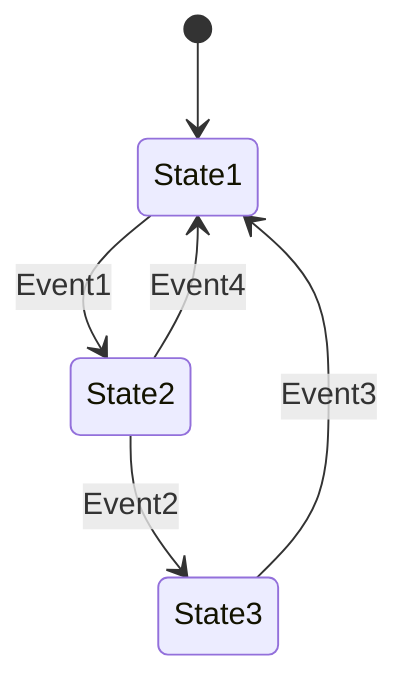
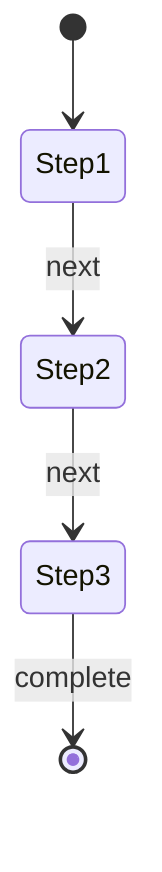
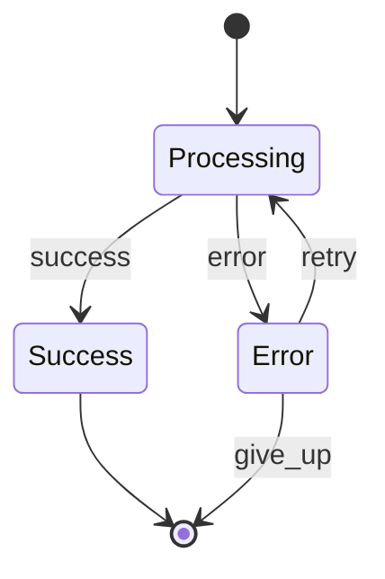
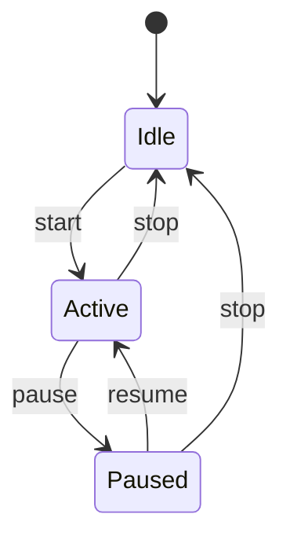

# Basic Concepts

Understanding the core concepts of state machines will help you design better applications and use
this library effectively.

## What is a State Machine?

A **finite state machine (FSM)** is a mathematical model of computation that describes the behavior
of a system with:

- A finite number of **states**
- **Transitions** between states triggered by **events**
- Exactly one **current state** at any time
- An **initial state** where the machine starts



## Core Components

### States

A **state** represents a specific condition or situation in your system. States should be:

- **Mutually exclusive** - only one state can be active at a time
- **Well-defined** - each state should have a clear meaning
- **Finite** - there should be a limited number of states

```javascript showLineNumbers
// Good state design
const states = ['IDLE', 'LOADING', 'SUCCESS', 'ERROR'];

// Poor state design (not mutually exclusive)
const badStates = ['LOADING', 'FAST_LOADING', 'SLOW_LOADING']; // Overlapping concepts
```

### Events

An **event** is a trigger that can cause a state transition. Events represent:

- User actions (click, submit, cancel)
- System events (timeout, response received)
- External triggers (API calls, notifications)

```javascript showLineNumbers
const events = ['START', 'SUCCESS', 'FAILURE', 'RETRY', 'CANCEL'];
```

### Transitions

A **transition** defines how the system moves from one state to another in response to an event:

```javascript showLineNumbers
// From state 'IDLE', when 'START' event occurs, go to 'LOADING' state
.transition('IDLE', 'LOADING', 'START')
```

### Initial State

The **initial state** is where the state machine begins when started:

```javascript showLineNumbers
.initialState('IDLE') // Machine starts in IDLE state
```

## Advanced Concepts

### Context

**Context** is additional data that travels with the state machine, providing information needed for
decisions:

```javascript showLineNumbers
const context = {
  userId: '123',
  attempts: 0,
  lastError: null,
  data: []
};

// Context can be used in guards and actions
.guard((context) => context.attempts < 3)
.action((context) => context.attempts++)
```

### Guards

**Guards** are conditions that must be true for a transition to occur:

```javascript showLineNumbers
.transition('LOGGED_OUT', 'LOGGED_IN', 'login')
.guard((context) => context.username && context.password)
.guard((context) => context.attempts < 5) // Multiple guards (AND logic)
```

Guards provide:

- **Conditional logic** - transitions only when conditions are met
- **Data validation** - ensure context is in valid state
- **Business rules** - enforce domain-specific constraints

### Actions

**Actions** are side effects that execute during transitions or state changes:

```javascript showLineNumbers
// Transition action - executes during transition
.transition('IDLE', 'LOADING', 'start')
.action((context) => {
  context.startTime = Date.now();
  console.log('Loading started');
})

// Entry action - executes when entering a state
.onStateEntry('LOADING', (context) => {
  context.loadingSpinner = true;
})

// Exit action - executes when leaving a state
.onStateExit('LOADING', (context) => {
  context.loadingSpinner = false;
})
```

## State Machine Properties

### Deterministic Behavior

State machines are **deterministic** - given the same state and event, the outcome is always the
same:

```javascript showLineNumbers
// Always predictable
currentState = 'IDLE';
event = 'START';
// Result will always be 'LOADING' (if transition exists)
```

### No Invalid States

Well-designed state machines prevent **impossible states**:

```javascript showLineNumbers
// Impossible with state machine
const badState = {
  isLoading: true,
  isComplete: true, // Can't be loading AND complete
  hasError: true, // Can't be complete AND have error
};

// State machine prevents this
const validStates = ['LOADING', 'COMPLETE', 'ERROR']; // Mutually exclusive
```

### Explicit Transitions

All state changes must be **explicitly defined**:

```javascript showLineNumbers
// Must define all valid transitions
.transition('A', 'B', 'event1')
.transition('B', 'C', 'event2')
// No transition from A to C directly - prevents unexpected state changes
```

## Design Patterns

### Linear Flow

States follow a sequential progression:



```javascript showLineNumbers
const wizardMachine = StateMachine.builder()
  .initialState('STEP_1')
  .transition('STEP_1', 'STEP_2', 'next')
  .transition('STEP_2', 'STEP_3', 'next')
  .transition('STEP_3', 'COMPLETE', 'finish')
  .build();
```

### Branching Flow

States can branch based on conditions:



```javascript showLineNumbers
const processingMachine = StateMachine.builder()
  .initialState('PROCESSING')
  .transition('PROCESSING', 'SUCCESS', 'success')
  .transition('PROCESSING', 'ERROR', 'error')
  .transition('ERROR', 'PROCESSING', 'retry')
  .build();
```

### Cyclic Flow

States can return to previous states:



## Best Practices

### State Naming

Use clear, descriptive state names:

```javascript showLineNumbers
// Good
const states = ['IDLE', 'AUTHENTICATING', 'AUTHENTICATED', 'FAILED'];

// Poor
const states = ['S1', 'S2', 'S3', 'S4'];
```

### Event Naming

Use action-oriented event names:

```javascript showLineNumbers
// Good
const events = ['LOGIN', 'LOGOUT', 'TIMEOUT', 'RETRY'];

// Poor
const events = ['E1', 'THING_HAPPENED', 'STUFF'];
```

### Single Responsibility

Each state should represent one clear concept:

```javascript showLineNumbers
// Good - each state has single responsibility
.state('LOADING')     // Only loading
.state('VALIDATING')  // Only validating
.state('SAVING')      // Only saving

// Poor - mixed responsibilities
.state('LOADING_AND_VALIDATING') // Doing too much
```

### Minimal States

Use the minimum number of states needed:

```javascript showLineNumbers
// Good - essential states only
const states = ['IDLE', 'PROCESSING', 'COMPLETE', 'ERROR'];

// Poor - unnecessary granularity
const states = [
  'IDLE',
  'STARTING',
  'PROCESSING_STEP_1',
  'PROCESSING_STEP_2',
  'ALMOST_DONE',
  'COMPLETE',
];
```

## Common Anti-Patterns

### Boolean Soup

Avoid using multiple boolean flags instead of states:

```javascript showLineNumbers
// Anti-pattern
const component = {
  isLoading: false,
  isError: false,
  isSuccess: false,
  isRetrying: false,
};

// Better - use state machine
const states = ['IDLE', 'LOADING', 'SUCCESS', 'ERROR', 'RETRYING'];
```

### Implicit State

Avoid deriving state from other properties:

```javascript showLineNumbers
// Anti-pattern
const isLoading = !data && !error;

// Better - explicit state
const currentState = machine.getCurrentState(); // 'LOADING'
```

### Missing Transitions

Don't forget to handle all possible events in each state:

```javascript showLineNumbers
// Incomplete - what if 'cancel' happens during 'LOADING'?
.transition('IDLE', 'LOADING', 'start')
.transition('LOADING', 'SUCCESS', 'complete')

// Complete - handle all events
.transition('IDLE', 'LOADING', 'start')
.transition('LOADING', 'SUCCESS', 'complete')
.transition('LOADING', 'CANCELLED', 'cancel') // Handle cancellation
```

## Next Steps

Now that you understand the core concepts, explore:

- [Builder Pattern](../guides/builder-pattern) - Learn the fluent API
- [Guards and Actions](../guides/guards-and-actions) - Add logic to your state machines
