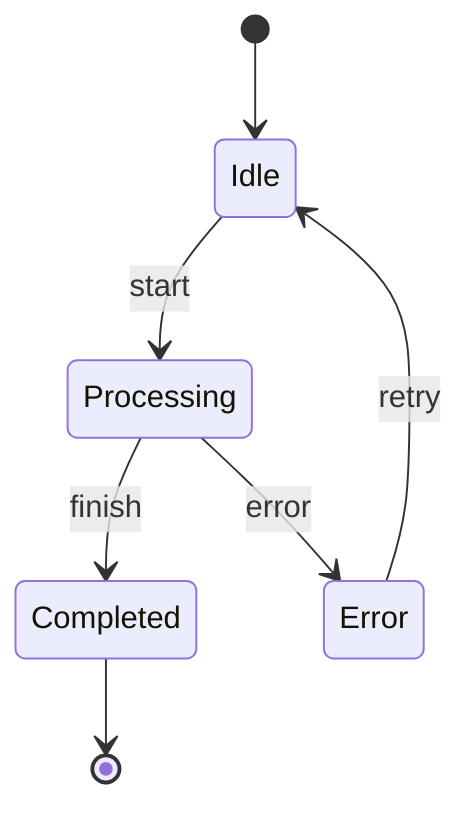

# Introduction

Welcome to **@jewel998/state-machine** - a lightweight, type-safe state machine library for
JavaScript and TypeScript that brings production-ready performance and clean architecture to your
applications.

## What is a State Machine?

A state machine is a computational model that describes the behavior of a system with a finite
number of states. It can be in exactly one state at any given time and can transition from one state
to another in response to events.



## Why Use State Machines?

State machines provide several benefits for application development:

- **Predictable Behavior** - Clear rules for state transitions eliminate unexpected states
- **Easier Testing** - Well-defined states and transitions make testing straightforward
- **Better Documentation** - State diagrams serve as living documentation
- **Reduced Bugs** - Impossible states are prevented by design
- **Maintainable Code** - Complex logic is organized into manageable pieces

## Key Features

<div className="feature-card">

### 🎯 Declarative API

Clean, intuitive syntax for defining states and transitions with a fluent builder pattern.

</div>

<div className="feature-card">

### 🔒 Type Safety

Full TypeScript support with strict type checking for states, events, and context.

</div>

<div className="feature-card">

### 🛡️ Guard Conditions

Conditional transition logic to control when transitions can occur.

</div>

<div className="feature-card">

### 📝 Actions

Execute code during state entry, exit, and transitions for side effects.

</div>

<div className="feature-card">

### 🚨 Error Handling

Comprehensive error types with automatic rollback and recovery mechanisms.

</div>

<div className="feature-card">

### ⚡ Performance

Optimized for production use with server-scale performance testing.

</div>

## Quick Example

Here's a simple example of a state machine for order processing:

```javascript
import { StateMachine } from '@jewel998/state-machine';

const orderMachine = StateMachine.builder()
  .initialState('PENDING')
  .state('PENDING')
  .state('APPROVED')
  .state('REJECTED')
  .state('SHIPPED')
  .transition('PENDING', 'APPROVED', 'approve')
  .transition('PENDING', 'REJECTED', 'reject')
  .transition('APPROVED', 'SHIPPED', 'ship')
  .build();

// Start the machine
orderMachine.start();
console.log(orderMachine.getCurrentState()); // 'PENDING'

// Trigger transitions
orderMachine.sendEvent('approve');
console.log(orderMachine.getCurrentState()); // 'APPROVED'

orderMachine.sendEvent('ship');
console.log(orderMachine.getCurrentState()); // 'SHIPPED'
```

## Performance Metrics

<div className="perf-metrics">
  <div className="perf-metric">
    <div className="perf-metric-value">~45KB</div>
    <div className="perf-metric-label">Bundle Size</div>
  </div>
  <div className="perf-metric">
    <div className="perf-metric-value">1M+</div>
    <div className="perf-metric-label">Operations/sec</div>
  </div>
  <div className="perf-metric">
    <div className="perf-metric-value">100%</div>
    <div className="perf-metric-label">Type Safe</div>
  </div>
  <div className="perf-metric">
    <div className="perf-metric-value">Zero</div>
    <div className="perf-metric-label">Dependencies</div>
  </div>
</div>

## Use Cases

- **Workflow Management** - Model business processes and approval workflows
- **Game Development** - Manage game states, character states, and UI flows
- **Form Validation** - Handle multi-step forms with complex validation rules
- **API Integration** - Manage request/response cycles and error handling
- **UI Components** - Control component behavior and user interactions

## Next Steps

Ready to get started? Check out our [Installation Guide](getting-started/installation) or jump
straight into the [Quick Start](getting-started/quick-start) tutorial.

For detailed API documentation, visit the [API Reference](/api) section.
