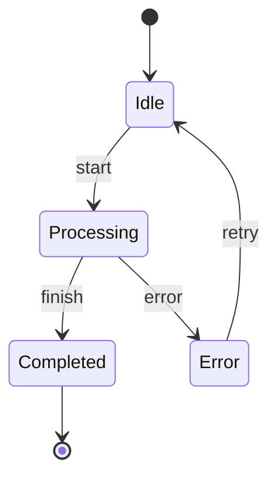

# Introduction

Welcome to **State Machine** - a lightweight, type-safe state machine library for JavaScript and
TypeScript that brings production-ready performance and clean architecture to your applications.

## What is a State Machine?

A state machine is a computational model that describes the behavior of a system with a finite
number of states. It can be in exactly one state at any given time and can transition from one state
to another in response to events.



## Why Use State Machines?

State machines provide several benefits for application development:

- **Predictable Behavior** - Clear rules for state transitions eliminate unexpected states
- **Easier Testing** - Well-defined states and transitions make testing straightforward
- **Better Documentation** - State diagrams serve as living documentation
- **Reduced Bugs** - Impossible states are prevented by design
- **Maintainable Code** - Complex logic is organized into manageable pieces

## Key Features

<div className="feature-card">

### 🎯 Declarative API

Clean, intuitive syntax for defining states and transitions with a fluent builder pattern.

</div>

<div className="feature-card">

### 🔒 Type Safety

Full TypeScript support with strict type checking for states, events, and context.

</div>

<div className="feature-card">

### 🔧 Middleware Pipeline System

Powerful middleware pipeline architecture with BaseMiddleware class, lifecycle hooks, and extensible
functionality for immutability, logging, validation, and custom middleware.

</div>

<div className="feature-card">

### 🛡️ Guard Conditions

Conditional transition logic to control when transitions can occur.

</div>

<div className="feature-card">

### 📝 Actions

Execute code during state entry, exit, and transitions for side effects.

</div>

<div className="feature-card">

### 🚨 Error Handling

Comprehensive error types with automatic rollback and recovery mechanisms.

</div>

<div className="feature-card">

### ⚡ Performance

Optimized for production use with server-scale performance testing.

</div>

## Usage

Here's how you would implement the same order processing logic with the actual library:

```javascript showLineNumbers
import { StateMachine } from '@jewel998/state-machine';

// Create a stateless definition (shared across all orders)
const orderDefinition = StateMachine.definitionBuilder()
  .initialState('PENDING')
  .state('PENDING')
  .state('APPROVED')
  .state('REJECTED')
  .state('SHIPPED')

  .transition('PENDING', 'APPROVED', 'approve')
  .transition('PENDING', 'REJECTED', 'reject')
  .transition('APPROVED', 'SHIPPED', 'ship')

  .buildDefinition();

// Order class that uses the shared definition
class Order {
  constructor(id) {
    this.id = id;
    this.state = orderDefinition.getInitialState(); // 'PENDING'
    this.context = { orderId: id, timestamp: new Date() };
  }

  processEvent(event) {
    const result = orderDefinition.processEvent(this.state, event, this.context);
    if (result.success) {
      this.state = result.newState;
      console.log(`Order ${this.id}: ${event} → ${this.state}`);
      return true;
    } else {
      console.log(`Order ${this.id}: Cannot ${event} from ${this.state}`);
      return false;
    }
  }

  getAvailableEvents() {
    return orderDefinition.getAvailableEvents(this.state, this.context);
  }
}

// Usage
const order = new Order('ORD-001');
console.log(order.state); // 'PENDING'
console.log(order.getAvailableEvents()); // ['approve', 'reject']

order.processEvent('approve'); // Order ORD-001: approve → APPROVED
order.processEvent('ship'); // Order ORD-001: ship → SHIPPED
```

## Stateless Pattern for Scalability

The library uses a stateless pattern where definitions are shared across instances for maximum
efficiency:

```javascript showLineNumbers
import { StateMachine } from '@jewel998/state-machine';

// Create a shared definition (no instance state)
const orderDefinition = StateMachine.definitionBuilder()
  .initialState('PENDING')
  .state('PENDING')
  .state('APPROVED')
  .state('REJECTED')
  .state('SHIPPED')

  .transition('PENDING', 'APPROVED', 'approve')
  .transition('PENDING', 'REJECTED', 'reject')
  .transition('APPROVED', 'SHIPPED', 'ship')

  .buildDefinition();

// Objects just track their state
class Order {
  constructor(id) {
    this.id = id;
    this.state = orderDefinition.getInitialState(); // 'PENDING'
    this.context = { orderId: id };
  }

  processEvent(event) {
    const result = orderDefinition.processEvent(this.state, event, this.context);
    if (result.success) {
      this.state = result.newState;
      return true;
    }
    return false;
  }
}

// Efficient: 1M orders share ONE definition
const orders = Array.from({ length: 1000000 }, (_, i) => new Order(i));
```

## Middleware Pipeline System

Create powerful, composable middleware with the pipeline architecture:

```javascript showLineNumbers
import { StateMachine, BaseMiddleware } from '@jewel998/state-machine';

// Create custom middleware extending BaseMiddleware
class LoggingMiddleware extends BaseMiddleware {
  constructor() {
    super('logging', { priority: 100 });
  }

  async onAction(context, next) {
    console.log('Action starting...');
    const result = await next();
    console.log('Action completed');
    return result;
  }
}

const definition = StateMachine.definitionBuilder()
  .initialState('IDLE')
  .state('IDLE')
  .state('LOADING')

  .transition('IDLE', 'LOADING', 'fetch')
  .action(async (context) => {
    context.data = await fetchData();
  })

  // Add middleware pipeline
  .addMiddleware(new LoggingMiddleware())
  .buildDefinition();

// Middleware executes during async transitions
const result = await definition.processEventAsync('IDLE', 'fetch', context);
```

## Performance Metrics

<div className="perf-metrics">
  <div className="perf-metric">
    <div className="perf-metric-value">~45KB</div>
    <div className="perf-metric-label">Bundle Size</div>
  </div>
  <div className="perf-metric">
    <div className="perf-metric-value">1M+</div>
    <div className="perf-metric-label">Operations/sec</div>
  </div>
  <div className="perf-metric">
    <div className="perf-metric-value">100%</div>
    <div className="perf-metric-label">Type Safe</div>
  </div>
  <div className="perf-metric">
    <div className="perf-metric-value">Zero</div>
    <div className="perf-metric-label">Dependencies</div>
  </div>
</div>

## Use Cases

- **Workflow Management** - Model business processes and approval workflows
- **Game Development** - Manage game states, character states, and UI flows
- **Form Validation** - Handle multi-step forms with complex validation rules
- **API Integration** - Manage request/response cycles and error handling
- **UI Components** - Control component behavior and user interactions

## Next Steps

Ready to get started? Check out our [Installation Guide](/docs/getting-started/installation) or jump
straight into the [Quick Start](/docs/getting-started/quick-start) tutorial.

For detailed API documentation, visit the [API Reference](/docs/api) section.
